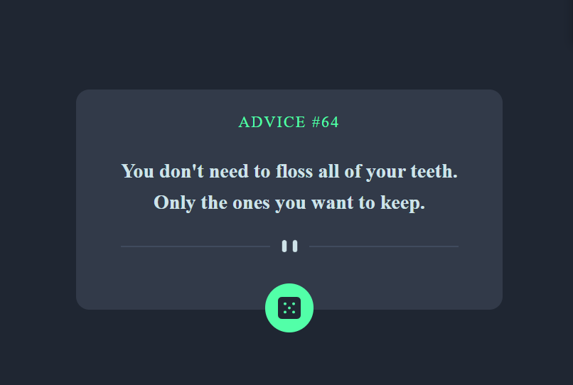

# Frontend Mentor - Advice generator app solution

This is a solution to the [Advice generator app challenge on Frontend Mentor](https://www.frontendmentor.io/challenges/advice-generator-app-QdUG-13db). Frontend Mentor challenges help you improve your coding skills by building realistic projects.

## Table of contents

- [Overview](#overview)
  - [The challenge](#the-challenge)
  - [Screenshot](#screenshot)
  - [Links](#links)
- [My process](#my-process)
  - [Built with](#built-with)
  - [What I learned](#what-i-learned)
- [Author](#author)

## Overview

### The challenge

Users should be able to:

- View the optimal layout for the app depending on their device's screen size
- See hover states for all interactive elements on the page
- Generate a new piece of advice by clicking the dice icon

### Screenshot



### Links

- Solution URL: [Add solution URL here](https://github.com/Sri1729/Advice-Generator)

## My process

### Built with

- [React](https://reactjs.org/) - JS library
- [Tailwind Css](https://tailwindcss.com/) - For styles
- [Redux ToolKit](https://redux-toolkit.js.org/) - For state management

### What I learned

```css
.proud-of-this-css {
  color: papayawhip;
}
```

```js
const proudOfThisFunc = () => {
  console.log("🎉");
};
```

```
Brush up of redux toolkit and the concept of createAsyncThunk.
```

## Author

- Frontend Mentor - [Sriram Chamarthy](https://www.frontendmentor.io/profile/Sri1729)
- HackerRank - [sriram2491999](https://www.hackerrank.com/sriram2491999)
- LinkedIn - [Sriram Chamarthy](https://www.linkedin.com/in/sriram-chamarthy-063177146/)
